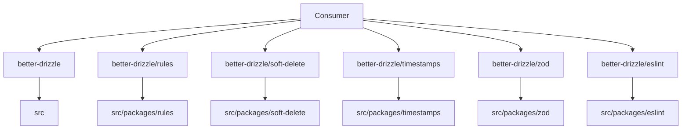

# Consolidated Package Design

**Spec**: `.specs/features/consolidated-package/spec.md`
**Status**: Approved

## Architecture Overview

The root package becomes the only publishable package. Core source moves to `src/`; first-party integrations move to `src/packages/<name>/`. A single tsdown build emits one distribution tree, and the root export map exposes each integration explicitly.

## Code Reuse Analysis

| Component | Location | How to Use |
| --- | --- | --- |
| Current core entrypoint | `packages/core/src/index.ts` | Move unchanged to `src/index.ts`. |
| Plugin implementations | `packages/{rules,soft-delete,timestamps,zod,eslint}/src` | Move unchanged below `src/packages/`. |
| Current tsdown settings | `tsdown.config.ts` | Extend its entry list and keep existing ESM/CJS/declaration settings. |
| Package-pack checks | root `package.json` scripts | Replace per-package pack checks with one root tarball export probe. |
| Existing test suites | `packages/*/tests` | Relocate under `tests/` and change imports to root subpaths. |

## Components

### Root package source

- **Purpose**: Own the core runtime and all public npm entrypoints.
- **Location**: `src/` and `src/packages/*/`.
- **Interfaces**: `src/index.ts`; `src/packages/{rules,soft-delete,timestamps,zod,eslint}/index.ts`.
- **Dependencies**: Drizzle ORM, TypeScript, and optional integration peer dependencies.
- **Reuses**: Existing source files without runtime redesign.

### Unified build and export map

- **Purpose**: Build every public entrypoint into `dist/` and make only those paths importable.
- **Location**: `tsdown.config.ts`, `package.json`.
- **Interfaces**: root export map entries for `.`, `./rules`, `./soft-delete`, `./timestamps`, `./zod`, and `./eslint`.
- **Dependencies**: tsdown and package declaration output.
- **Reuses**: Existing dual-format and minified tree-shaken build configuration.

### Optional integration peers

- **Purpose**: Avoid requiring Zod or ESLint for consumers that do not import their subpaths.
- **Location**: root `package.json` peer dependency metadata.
- **Interfaces**: optional peer entries for `zod`, `eslint`, and `@typescript-eslint/parser`.
- **Dependencies**: npm peer dependency resolution.
- **Reuses**: Existing plugin peer version ranges.

### Documentation and tests

- **Purpose**: Teach and verify only the unified import surface.
- **Location**: `README.md`, `apps/web/content/docs`, `skills/better-drizzle`, `tests/`.
- **Interfaces**: documented installation and import statements; tarball subpath probe.
- **Dependencies**: built distribution and npm pack.
- **Reuses**: Existing plugin behavior tests and documentation structure.

## Data Models

No runtime data model changes.

## Error Handling Strategy

| Error Scenario | Handling | User Impact |
| --- | --- | --- |
| Missing optional peer | Let the imported integration's native module resolution fail with its normal peer-dependency error. | Only consumers of that integration are affected. |
| Missing built subpath | Root package export map rejects the unlisted import. | Prevents unsupported deep imports. |
| Incomplete tarball | Pack validation resolves every documented export from the generated tarball before release. | Release is blocked locally. |

## Risks & Concerns

| Concern | Location | Impact | Mitigation |
| --- | --- | --- | --- |
| Existing tsdown config assumes a package-local current working directory. | `tsdown.config.ts:4` | Root build needs distinct entries and output paths. | Make entries root-relative and test the packed export map. |
| TypeScript aliases and ESLint's dependency currently use scoped package names. | `tsconfig.json:7`, `packages/eslint/src/shared/config.ts:5` | Internal builds or tests can resolve stale package names. | Replace aliases and imports with root subpaths before deleting old manifests. |
| Public docs contain many old installation instructions. | `README.md:294`, `apps/web/content/docs/plugins/*` | Users receive invalid imports after release. | Repository-wide replacement plus stale-reference gate. |

## Tech Decisions

| Decision | Choice | Rationale |
| --- | --- | --- |
| Distribution shape | One root npm package with explicit subpath exports | npm cannot publish `better-drizzle/zod` as a separate package. |
| Source shape | `src/` for core and `src/packages/*` for integrations | Matches the requested layout without merging integration internals. |
| Compatibility policy | Major breaking release, no scoped wrappers | Keeps the package surface unambiguous and removes duplicate release artifacts. |
| Optional integrations | Optional root peer dependencies | Avoids adding Zod and ESLint to every core installation. |
